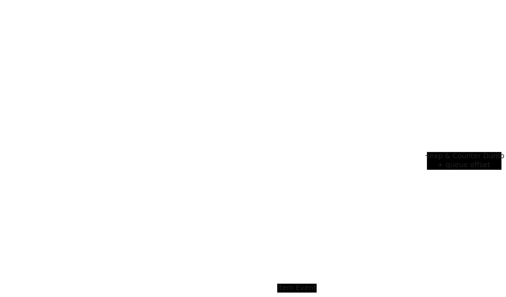

# top-k-system-go

Example **GoLang** implementation of a system that will allow querying top k most popular items for a given time period (1 hour, 1 day, 1 month or all time). The implementation will use a precise calculation rather than doing a probabilistic/approximate calculation (e.g using [count-min sketch](https://en.wikipedia.org/wiki/Count–min_sketch)).

The design is inspired by the [Top-K Youtube Videos](https://www.hellointerview.com/learn/system-design/answer-keys/top-k).

This is a work in progress

## System Design

### Functional Requirements:
* It should be possible to query top K items (max 1000) for a given time window.
* Time windows are: last hour, last day, last month and all time.
  * Initial implementation will address `all time` only.

### Non Functional Requirements:
* Eventual consistency on querying top K items (few minutes tolerance)
* The system should support large volume of events that are incrementing popularity of the item (e.g view events or similar)
* The system should support large volume of items
* The topK query should be fast (100ms or less)

### APIs:
* POST /items/events - ingest item event
* GET /items/top-k?window=all-time&limit=100 - return top 100 items

### High level conceptual design of the solution


The input of the system are `Item Events` that are increasing popularity. In real world system this can be `view events` (youtube video items), `file downloaded` events (dropbox files) e.t.c. The events are processed as a stream and pre-aggregated with 1 minute intervals. The pre-aggregated data is then used to update hash map of TopK Counters. If any of the counter of any of the processed items becomes bigger than min item in a TopK Heap, the heap will be updated accordingly.

In order to support restarts and recovery, a periodical snapshots of the TopK Heap and TopK Counters will be saved to a BlobStorage. When new process of the `Top K Query Service` is starting up, it will get the last blob from the storage and catch-up remaining items from the stream.

### Capacity estimation

YouTube metrics will be used as a baseline:
* Total # of videos - 3.9 billion
* 2.4 million videos uploaded every day
* 5 billion videos watched each day

Metrics sources: 
* https://photutorial.com/how-many-videos-on-youtube
* https://www.comparitech.com/tv-streaming/youtube-statistics

It is assumed that each item has ID of 36 bytes max (uuid). Views counter will be stored as int64 (8 bytes) since some videos may have more than 4B views. TopK Counter hash map size will be: (36 + 8) * 4B = 176B bytes ~ `176GB` of memory. TopK Heap will store just 1000 items so it's size is insignificant.

Given the memory requirement, we will shard our system by item ID. This can create a hot shard problem that will be ignored for now. In a `30 shards` setup it will be required up to `6GB` of memory to keep TopK Counters.

Data aggregation across shards can lead to increased TopK query latency. This problem is ignored for now.

Planned per shard request rate to ingest item events will be: 5B watched videos daily / 30 shards / 100k seconds = **1.6k rps**. This will be the baseline for our system.

### Monitoring

Our target is to process 1.6k rps of events and have counters incremented with few minutes delay max (will use 1 minute). We can periodically (every 30 seconds) submit a heart beat event into our stream and measure the duration it takes to have the heart beat event aggregated.

The TopK query will be done against in-memory heap, which is going to be very fast and may not need any special monitoring other than request latency. 

A cross shard aggregation latency is out of scope for now.

## Project Setup

Please have the following tools installed: 
* [direnv](https://github.com/direnv/direnv) 
* [gobrew](https://github.com/kevincobain2000/gobrew#install-or-update)

Install/Update dependencies: 
```sh
# Install
go mod download
make tools

# Update:
go get -u ./... && go mod tidy
```

Start local services:
```sh
docker compose up -d
```
This will start kafka broker and kafka-ui on port 8080.

### Lint and Tests

Run all lint and tests:
```bash
make lint
make test
```

Run specific tests:
```bash
# Run once
go test -v ./service/pkg/api/http/v1controllers/ --run TestHealthCheckController

# Run same test multiple times
# This is useful for tests that are flaky
go test -v -count=5 ./service/pkg/api/http/v1controllers/ --run TestHealthCheckController

# Run and watch
gow test -v ./service/pkg/api/http/v1controllers/ --run TestHealthCheckController
```
### Run local API server:

```bash
# Regular mode
go run ./cmd/service/

# Watch mode (double ^C to stop)
gow run ./cmd/service/
```

## Testing

In order to produce test events a command below can be used:
```sh
go run ./cmd/local_broker/ send-test-events -n 10
```
This will write 10 test events for a randomly generated item. You can optionally use --item-id parameter and specify the itemId to send test events for.